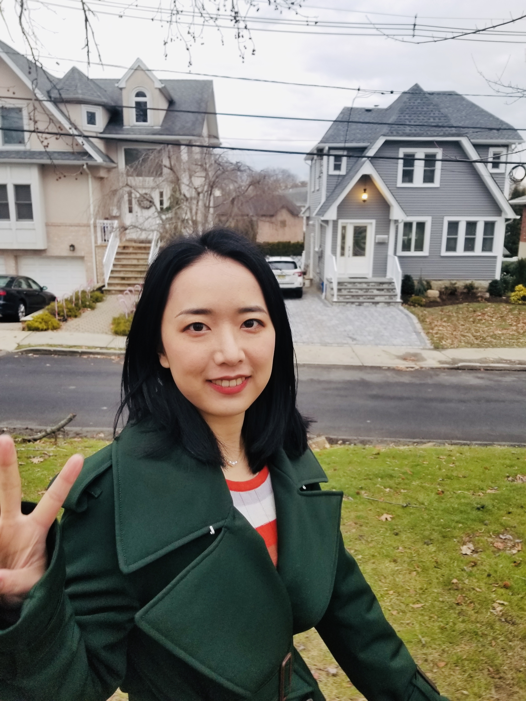

---
title: "About me"
---

### I'm a first year graduate student in Brice Kuhl's lab at the University of Oregon.

#### I am currently working on how pattern differentation happens in the hippocampus with fMRI. I use Python and R for data collection and analysis. Outside the lab, I enjoy cooking, (failing at) baking (and trying again), and hiking.

#### You can find me at [Twitter](https://twitter.com/GWJ_Amber), [Github](https://github.com/wanjiag), and [Email](mailto:wanjiag@uoregon.edu).

